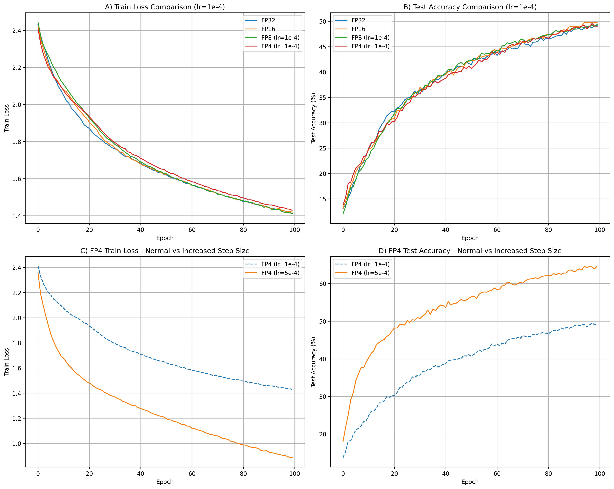
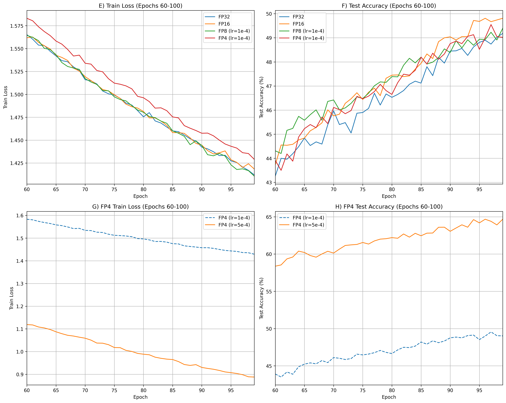
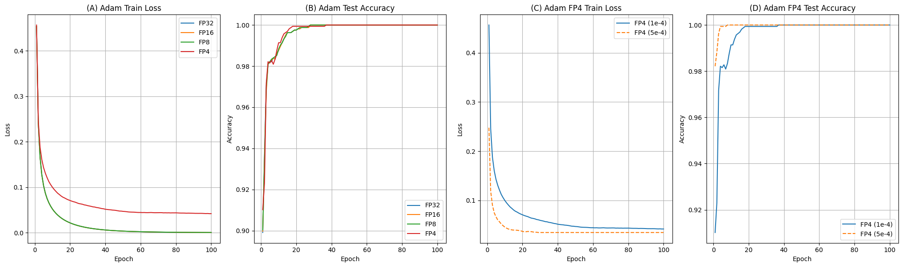
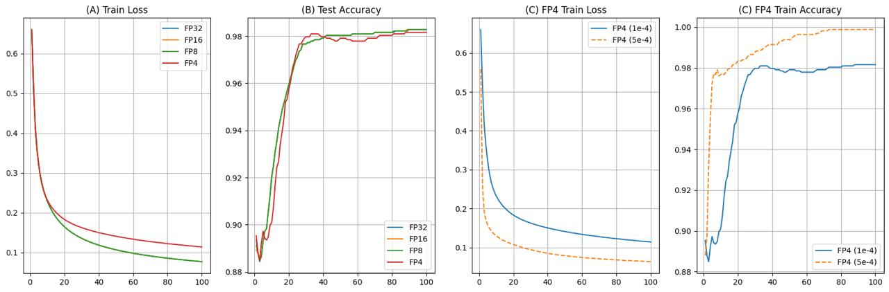
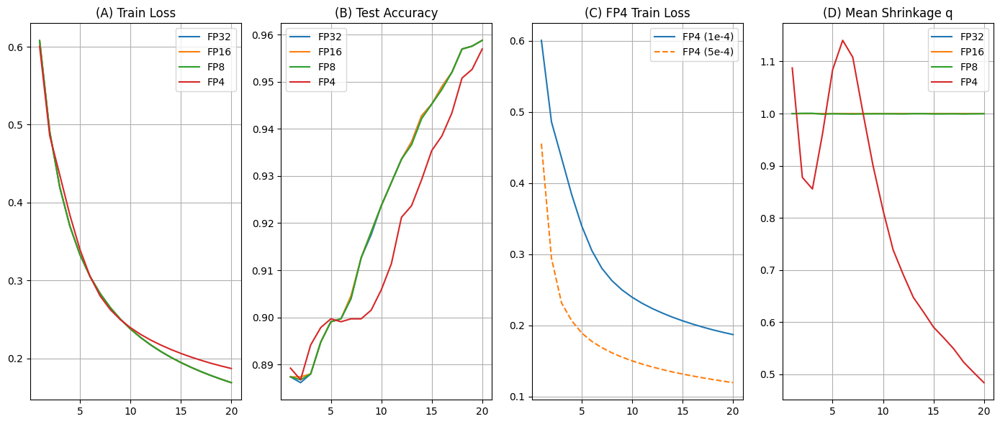

# Why-Does-Stochastic-Gradient-Descent-Slow-Down-in-Low-Precision-Training-

This repository contains code and experiments for reproducing and analyzing the slowdown effects in low-precision neural network training, based on the paper [Why Does Stochastic Gradient Descent Slow Down in Low-Precision Training?](https://openreview.net/forum?id=ZXkC0aYMDa).

## 📁 Repository Structure

```
.
├── main.py                      #to run all experiments
├── algorithms/
│   ├── configs.py               #all configurations
│   └── optim.py                 # SAGA, SAG, Adam updates
├── training/
│   ├── data/                    #store datasets
│   ├── data/load_everything.py  #load datasets (CIFAR10 and mushrooms)
│   ├── plots/plot_smth.py       #to plot
│   ├── metrics.py               #logloss and accuracy
│   ├── models.py                #modified ResNet50 for baseline
│   └── train.py                 #train different experiments
├── quantization/
│   └── quant.py                 #quantization for different precisions
└── figures/                     #plots and results
```

## Overview

This project investigates the convergence slowdown in low-precision (FP4) neural network training across different optimization algorithms (SAGA, SAG, Adam).

### Contribution

1. **ResNet50 on CIFAR10**:
   - reproduced the original paper's setup
   - observed convergence slowdown at 60-100 epochs for FP4 with LR=1e-4

2. **Optimization Algorithms Analysis**:
   - Used logistic regression on mushrooms dataset to avoid memory constraints
   - Tested Adam, SAGA, and SAG optimizers
   - Consistently observed slowdown in FP4 precision with LR=1e-4

3. **SAGA, SAG, Adam**:
   - mean magnitude of shrinkage factor (q = ‖g̃‖₂/‖g‖₂)
   - quantization maps small gradient values to zero/coarse levels, reducing overall magnitude
   - FP4 shows noticeable decrease in shrinkage

## 📊 Experimental Results

### Baseline Performance

*Figure 1: Baseline convergence for ResNet50 on CIFAR10*

### SGD Slowdown

*Figure 2: SGD slowdown observed at 60-100 epochs with FP4 precision*

### Adam Optimization

*Figure 3: Convergence slowdown for Adam optimizer with FP4 precision*

### SAG Optimization

*Figure 4: Convergence slowdown for SAG optimizer with FP4 precision*

### SAGA Optimization

*Figure 5: SAGA slowdown with decreasing shrinkage factor in FP4 precision*

## How to use

1. **Install dependencies**:
```bash
pip install -r requirements.txt
```

2. **Run all experiments**:
```bash
python main.py
```

3. **Generate plots**:
```bash
python training/plots/plot_smth.py
```
